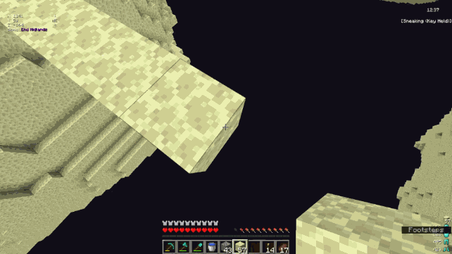
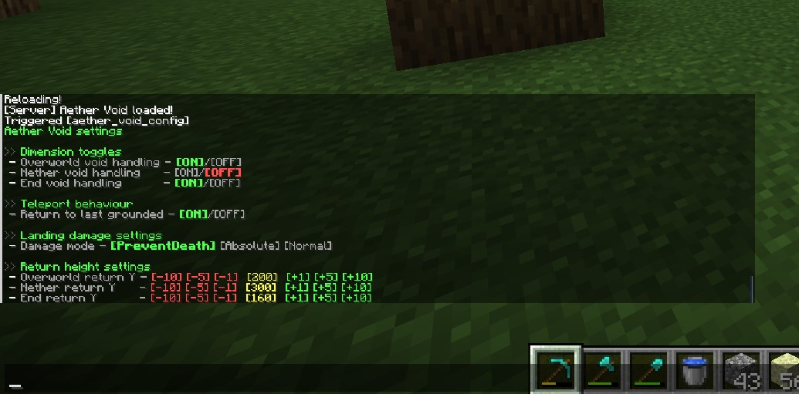

# Aether Void
A datapack that replaces Minecraft’s default void death with a controlled, configurable recovery system. Instead of instantly dying, players are detected before void death triggers and are teleported to a safe height, either above their last grounded position or above their current X/Z, and then handled by a configurable landing-damage mode.

The system is deterministic, dimension-aware and multiplayer-safe.

<p align="center">
  
<p/>

<br>

## Technical summary of features

### Void detection
- Per-dimension enable/disable:
  - `Overworld`, `The Nether`, `The End`
- Accurate void detection via predicate (`is_in_void`)
- Players cannot trigger void recovery twice simultaneously (`av_state` lock)

### Return position
- Tracks last grounded location using per-player marker entities
- Configurable teleport behavior:
  - Return above last grounded block
  - Return above current horizontal position
- Dimension-specific return heights

### Landing damage modes
Three distinct modes:

1. **PreventDeath**  
   - Prevents void-landing death by clamping player to half a heart.

2. **Absolute**  
   - Deals a fixed amount of damage defined by `Absolute Damage Taken`.

3. **Normal**  
   - Leaves landing damage fully vanilla (or modpack-modified).
  
Custom damage modes are ignored if the player lands on surfaces that would normally reset fall damage or if they start flying. Modded damage resetting methods are supported if they implement the same tags/states vanilla methods do.
Alternatively, if the player is not detected to have landed after a few seconds, the system returns to default state.

### Per-player state machine
- `av_state` marks players undergoing a void recovery sequence
- Unique per-player IDs (`av_pid`) bind markers to their owner
- State automatically resets on landing or player death

<br>

## Configuration

Access the UI with:

```
/function aether_void:config
```

or:

```
/trigger aether_void_config
```

<p align="center">
  
<p/>

The menu is fully interactive, using clickable tellraw buttons. It includes:

### Dimension toggles
- Overworld  
- Nether  
- End  

Each can be toggled ON/OFF.

### Teleport behavior
- Toggle: **Return to last grounded** vs **Return above current position**

### Damage mode selector (enum)
Three adjacent options, only one active at a time:
- PreventDeath
- Absolute
- Normal

### Absolute Mode settings
If Absolute Mode is active:
- Displayed with ±1 adjustment buttons
- Applies exact dynamic damage using macro-powered commands

### Return height settings
Each dimension gets a row with:
```
[-10] [-5] [-1]   [value]   [+1] [+5] [+10]
```
All handled through internal config functions.

<br>

## Macro usage
Aether Void uses function-macro expansion to support runtime-dynamic values:

```mcfunction
$tp @s $(x) $(y) $(z)
$damage @s $(amount)
```

Combined with:

```mcfunction
function ... with storage aether_void:coords
```

This allows:
- Dynamic teleport coordinates
- Config-driven damage values
- Clean parameter passing for all configuration actions

<br>

## Compatibility
- Fully vanilla datapack; no mods required
- Multiplayer-safe and dimension-aware
- Likely compatible with any datapacks and mods that don't include similar mechanics

<br>

## Installation

Place the datapack into:

```
<world>/datapacks/
```

Enable:

```
/datapack enable "file/aether_void"
```

Open the configuration menu:

```
/function aether_void:config
```
